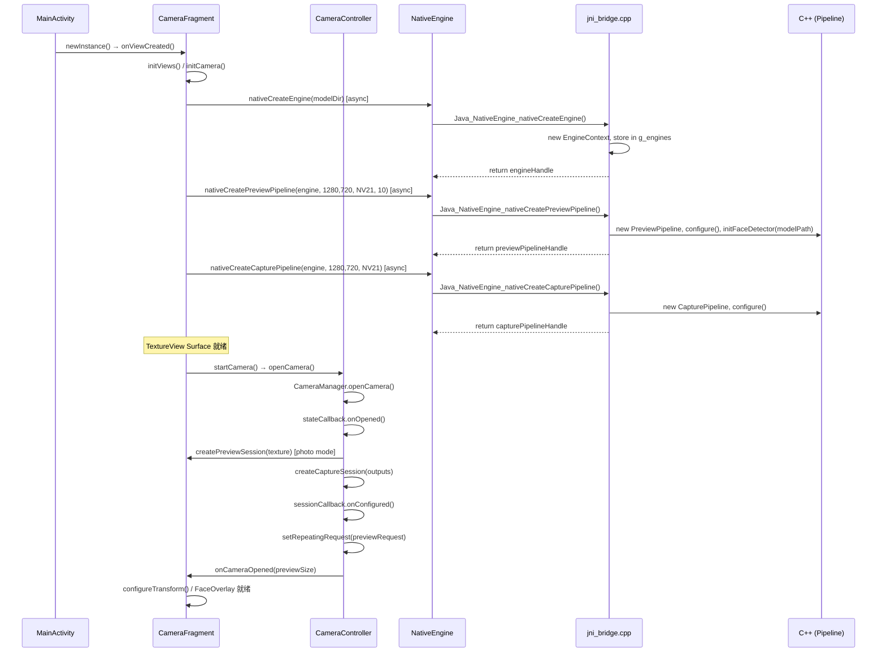
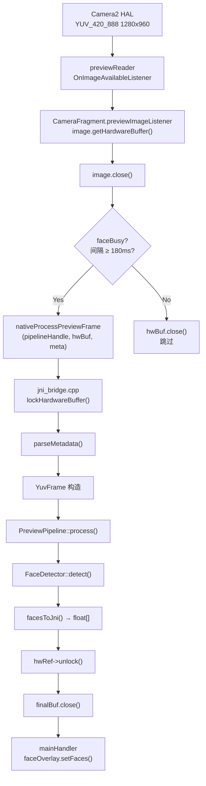
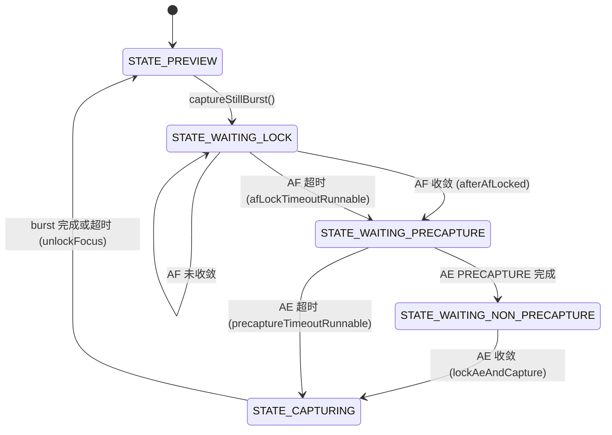
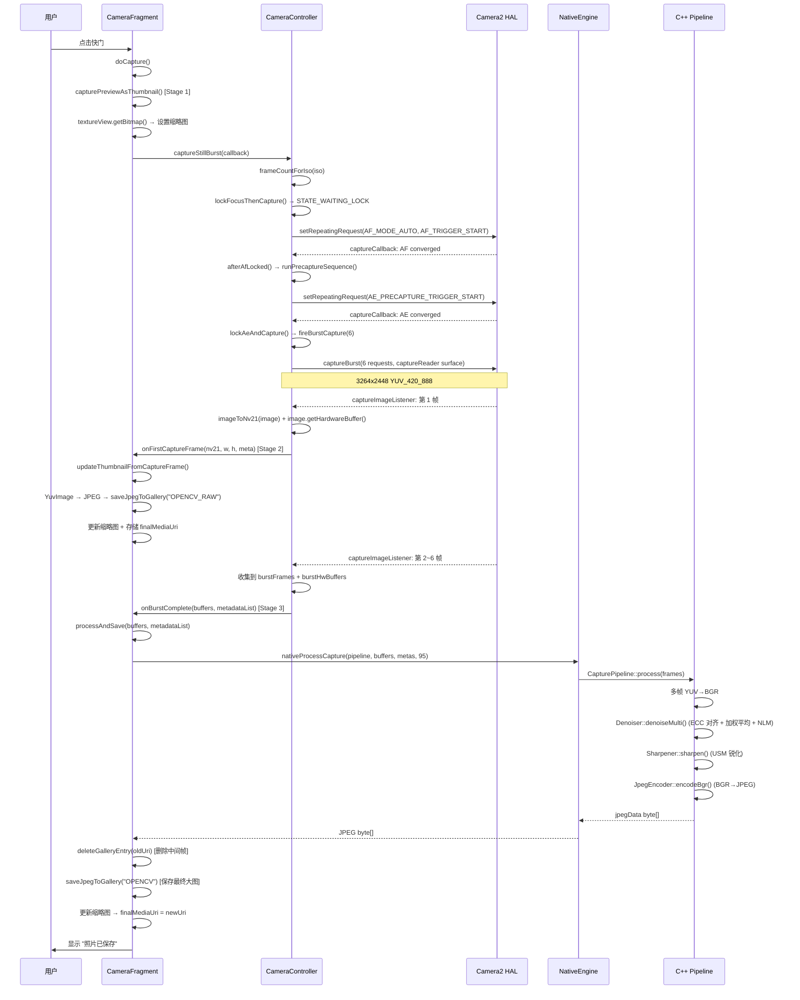
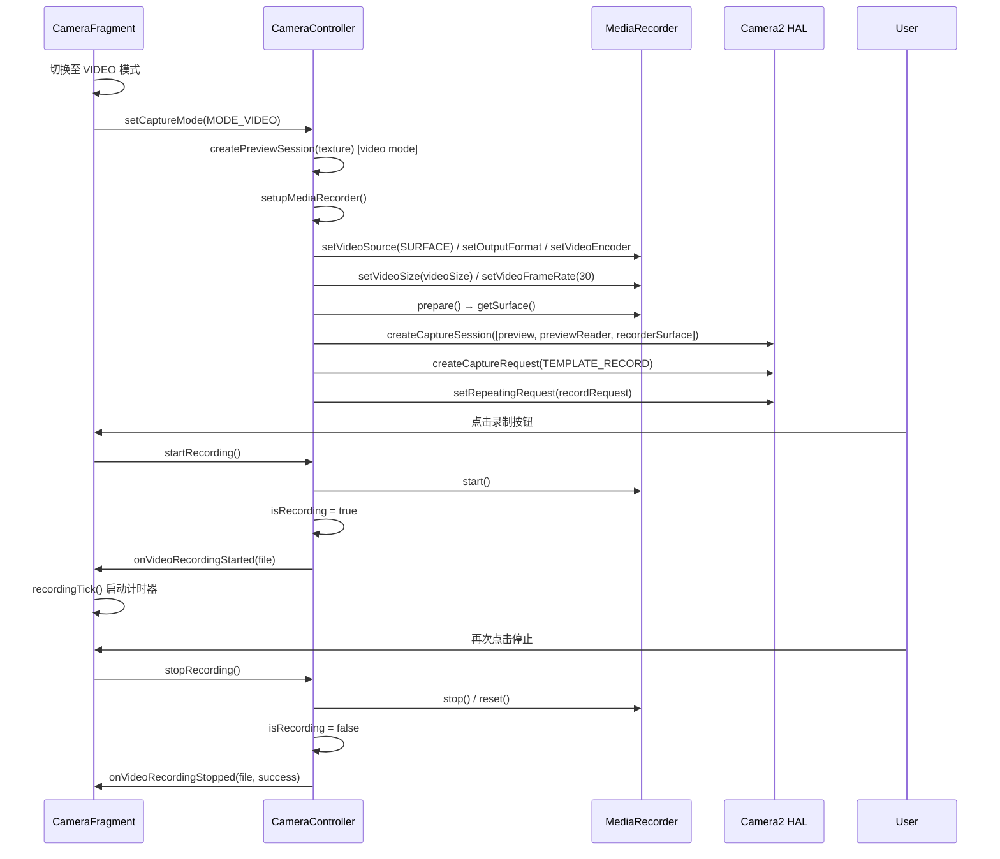
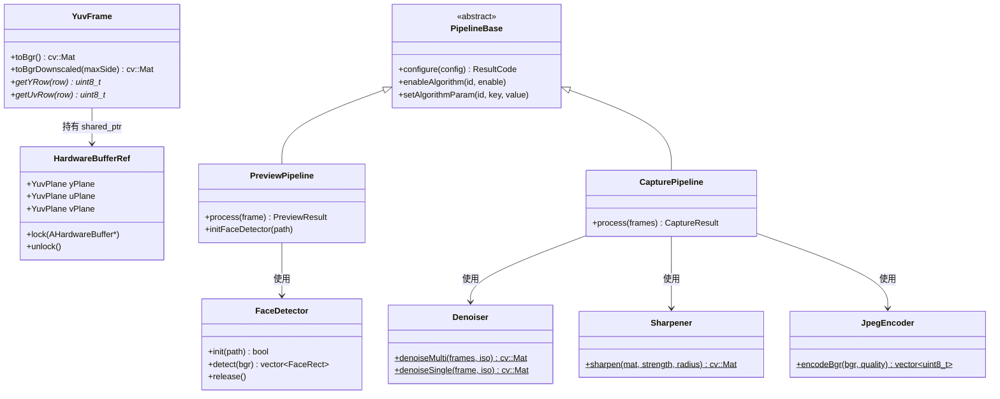
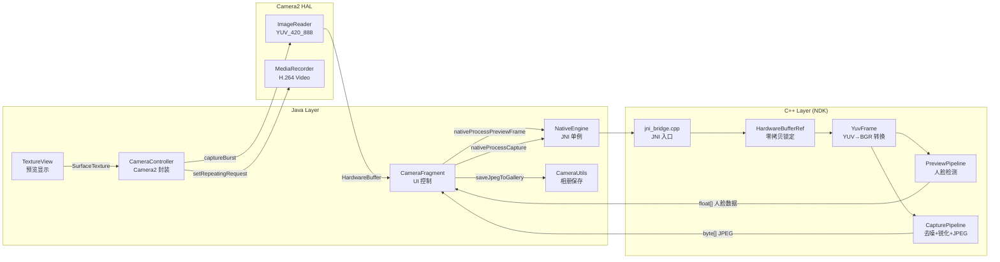

# Camera2 架构与流程文档

## 1. 项目概览

本工程为 Android Camera2 + OpenCV 相机应用，采用 **Java（UI） + C++（图像处理）分离架构**，通过 AHardwareBuffer 实现帧数据零拷贝传递。

| 维度 | 说明 |
|------|------|
| 框架 | Android Camera2 API (android.hardware.camera2) |
| 图像处理 | OpenCV 4.x (C++ NDK) |
| 帧传递 | AHardwareBuffer 零拷贝 + NV21 回退 |
| 人脸检测 | YuNet ONNX 模型 (OpenCV FaceDetectorYN) |
| 拍照增强 | 多帧 ECC 对齐 + 加权平均 + NLM 去噪 + USM 锐化 |
| 编译 | CMake + C++17, 4 ABI (arm64-v8a, armeabi-v7a, x86, x86_64) |

---

## 2. 目录结构与模块职责

```
camera2ndk/
├── Camera2.md                          ← 本文档
├── Application/
│   ├── CMakeLists.txt                  ← C++ 编译配置
│   ├── build.gradle                    ← 模块构建 (cppFlags -std=c++17)
│   └── src/main/
│       ├── AndroidManifest.xml
│       ├── java/com/opencv/camera/
│       │   ├── MainActivity.java       ← 入口 Activity, 全屏 + 加载 CameraFragment
│       │   ├── CameraFragment.java     ← 主相机 UI: 预览/拍照/录像/缩略图/人脸覆盖
│       │   ├── CameraController.java   ← Camera2 封装: 设备/会话/3A/连拍
│       │   ├── CameraUtils.java        ← 相册工具: JPEG 保存/打开/删除
│       │   ├── NativeEngine.java       ← JNI 单例: 引擎/管线/帧处理
│       │   ├── FrameMetadata.java      ← 帧元数据 POJO (ISO/曝光/状态)
│       │   ├── AutoFitTextureView.java ← 自适应宽高比 TextureView
│       │   ├── FaceOverlayView.java    ← 人脸框绘制 View
│       │   ├── GridOverlayView.java    ← 构图辅助线 View
│       │   └── SettingsFragment.java   ← 设置页: 人脸检测/网格/快门声
│       ├── res/                        ← 布局/字符串/图标/颜色/模型
│       └── cpp/
│           ├── core/
│           │   ├── types.h             ← 枚举/结构体: AlgorithmId, PipelineConfig, FaceRect
│           │   ├── metadata.h          ← FrameMetadata 结构体 (C++)
│           │   ├── hardware_buffer.h   ← HardwareBufferRef RAII 封装 (YuvPlane, lock/unlock)
│           │   ├── hardware_buffer.cpp
│           │   ├── frame.h             ← YuvFrame: YUV→BGR, 缩略转换
│           │   └── frame.cpp
│           ├── algorithms/
│           │   ├── face_detect.h/.cpp  ← YuNet 人脸检测 (OpenCV FaceDetectorYN)
│           │   ├── denoise.h/.cpp      ← 多帧/单帧 NLM 去噪 (ECC 对齐)
│           │   ├── sharpen.h/.cpp      ← USM 锐化
│           │   ├── hdr.h/.cpp          ← 曝光融合 HDR (预留)
│           │   ├── bokeh.h/.cpp        ← 背景虚化 (预留)
│           │   ├── clahe.h/.cpp        ← CLAHE 对比度增强 (预留)
│           │   └── saturation.h/.cpp   ← 饱和度调节 (预留)
│           ├── encode/
│           │   └── jpeg_encoder.h/.cpp ← BGR→JPEG 编码 (OpenCV imencode)
│           ├── pipeline/
│           │   ├── pipeline_base.h/.cpp    ← IAlgorithm 接口 + PipelineBase 抽象类
│           │   ├── preview_pipeline.h/.cpp ← PreviewPipeline: 人脸检测管线
│           │   └── capture_pipeline.h/.cpp ← CapturePipeline: 去噪→锐化→JPEG
│           └── jni/
│               └── jni_bridge.cpp      ← JNI 入口: 引擎/管线/帧处理/算法控制
```

---

## 3. 启动流程

### 3.1 文件调用链

```
MainActivity.onCreate()
  └─ setContentView(R.layout.activity_camera)     ← 全屏 Activity
  └─ setupFullScreen()                            ← 沉浸式全屏
  └─ CameraFragment.newInstance()                 ← 创建 Fragment
       └─ CameraFragment.onViewCreated()
            ├─ initViews(view)                    ← 绑定 UI 控件
            ├─ applyWindowInsets(view)            ← 刘海/导航栏适配
            ├─ applyPreferences()                 ← 读取 SharedPreferences
            ├─ initCamera()                       ← 初始化 CameraController + 设置 SurfaceTextureListener
            ├─ initNativeEngine()                 ← 异步创建 C++ 引擎和管线
            ├─ setupGestureDetectors()            ← 缩放/点击对焦手势
            ├─ setupModeSelector()                ← 照片/视频模式切换
            ├─ updateModeUi()                     ← 更新模式 UI
            └─ updateFlashUi()                    ← 更新闪光灯 UI
```

### 3.2 启动完整流程图



---

## 4. 预览流程

### 4.1 预览帧路径

```
Camera2 HAL → ImageReader (previewReader, 1280x960 YUV_420_888)
  → previewImageListener (CameraFragment)
    → image.getHardwareBuffer()          ← 零拷贝获取 HardwareBuffer
    → image.close()                      ← 释放 Image 引用
    → NativeEngine.getInstance().nativeProcessPreviewFrame(pipeline, hwBuf, meta)
      → jni_bridge.cpp: nativeProcessPreviewFrame()
        → lockHardwareBuffer()           ← AHardwareBuffer_lock (CPU 只读)
        → parseMetadata()                ← 解析 Java FrameMetadata
        → YuvFrame(hwRef, meta, NV21)    ← 构造 YuvFrame (零拷贝)
        → PreviewPipeline::process(frame)
          → 人脸检测门控 (intervalMs 限制)
          → frame.toBgrDownscaled(320)   ← YUV→BGR 缩略 (仅检测时)
          → FaceDetector::detect()       ← OpenCV FaceDetectorYN
          → 返回 vector<FaceRect>
        → hwRef->unlock()               ← AHardwareBuffer_unlock
        → facesToJni()                  ← 转为 float[] 返回
    → finalBuf.close()                  ← 释放 HardwareBuffer 引用
    → mainHandler: faceOverlay.setFaces(parseFaceResults(faceData))
```

### 4.2 预览流程图



### 4.3 涉及文件与函数

| 文件 | 函数 | 职责 |
|------|------|------|
| `CameraController.java` | `createPreviewSession()` | 创建 previewReader (1280x960, YUV_420_888) |
| `CameraController.java` | `sessionCallback.onConfigured()` | 启动 `setRepeatingRequest()` |
| `CameraFragment.java` | `previewImageListener` (匿名类) | 获取 HardwareBuffer, 调用 NativeEngine, 关闭 buffer |
| `NativeEngine.java` | `nativeProcessPreviewFrame()` | JNI 声明 |
| `jni_bridge.cpp` | `Java_NativeEngine_nativeProcessPreviewFrame()` | JNI 实现: lock/parse/process/unlock |
| `hardware_buffer.cpp` | `HardwareBufferRef::lock()` / `unlock()` | AHardwareBuffer 锁定/解锁 |
| `frame.cpp` | `YuvFrame::toBgrDownscaled()` | YUV→缩略 BGR |
| `preview_pipeline.cpp` | `PreviewPipeline::process()` | 门控 + 人脸检测 |
| `face_detect.cpp` | `FaceDetector::detect()` | OpenCV FaceDetectorYN 推理 |
| `FaceOverlayView.java` | `setFaces()`, `onDraw()` | 绘制人脸框 |

---

## 5. 拍照流程 (3 阶段缩略图管线)

### 5.1 拍照总览

```
快门点击 → [Stage 1] 预览帧缩略图
         → lockFocusThenCapture() → AF 收敛 → AE 预闪 → 连拍
         → [Stage 2] 首帧拍照帧 → 保存到相册 + 更新缩略图
         → [Stage 3] 算法后处理 → 删除中间帧 → 保存最终大图 → 更新缩略图
```

### 5.2 3A 状态机 (AF → AE → 连拍)



### 5.3 拍照完整流程图



### 5.4 涉及文件与函数

| 文件 | 函数 | 职责 |
|------|------|------|
| `CameraFragment.java` | `doCapture()` | 快门入口: 播放声音、启动预览帧缩略图、设置回调 |
| `CameraFragment.java` | `capturePreviewAsThumbnail()` | Stage 1: `textureView.getBitmap()` 抓取预览帧 |
| `CameraFragment.java` | `updateThumbnailFromCaptureFrame()` | Stage 2: NV21→YuvImage→JPEG→saveJpegToGallery("OPENCV_RAW") |
| `CameraFragment.java` | `processAndSave()` | Stage 3: 调用 C++ 管线 → 删除中间帧 → 保存最终结果 |
| `CameraFragment.java` | `processAndSaveLegacy()` | Stage 3 回退: 无 HardwareBuffer 时使用 NV21 byte[] |
| `CameraFragment.java` | `onThumbnailClick()` | 缩略图点击: 按阶段打开对应图片 |
| `CameraController.java` | `captureStillBurst()` | 拍照入口: 确定帧数, 启动 AF 锁定 |
| `CameraController.java` | `lockFocusThenCapture()` | AF 锁定: 发送 AF_TRIGGER_START |
| `CameraController.java` | `afterAfLocked()` | AF 收敛/超时后: 进入 AE 预闪 |
| `CameraController.java` | `runPrecaptureSequence()` | AE 预闪: 发送 AE_PRECAPTURE_TRIGGER_START |
| `CameraController.java` | `lockAeAndCapture()` | AE 收敛后: 锁定 AE, 触发连拍 |
| `CameraController.java` | `fireBurstCapture()` | 连拍: `captureBurst()` 发送 N 个请求 |
| `CameraController.java` | `captureImageListener` (匿名类) | 接收拍照帧: NV21 转换 + HardwareBuffer 提取 |
| `CameraController.java` | `finishBurstIfNeeded()` | 超时保护: 8s 后强制结束 |
| `CameraController.java` | `unlockFocus()` | 恢复预览: 解除 AE/AF 锁定, 重新 setRepeatingRequest |
| `CameraController.java` | `captureCallback.processResult()` | 3A 状态机: 解析 AF/AE 状态, 触发状态转换 |
| `CameraController.java` | `imageToNv21()` | Image→NV21 byte[] 转换 |
| `CameraController.java` | `extractMetadata()` | 从 CaptureResult 提取 FrameMetadata |
| `CameraController.java` | `frameCountForIso()` | 根据 ISO 确定连拍帧数 (1-6) |
| `CameraUtils.java` | `saveJpegToGallery()` | 保存 JPEG 到 MediaStore |
| `CameraUtils.java` | `deleteGalleryEntry()` | 删除指定 URI 的相册条目 |
| `CameraUtils.java` | `openLatestPhoto()` | 打开指定 URI 图片 |
| `NativeEngine.java` | `nativeProcessCapture()` | JNI 声明 |
| `jni_bridge.cpp` | `Java_NativeEngine_nativeProcessCapture()` | JNI 实现: 遍历锁帧→process→JPEG 返回 |
| `capture_pipeline.cpp` | `CapturePipeline::process()` | 去噪→锐化→JPEG 编码 |
| `denoise.cpp` | `Denoiser::denoiseMulti()` | 多帧: ECC 对齐 + 加权平均 + NLM 去噪 |
| `denoise.cpp` | `Denoiser::denoiseSingle()` | 单帧: 直接 NLM 去噪 |
| `sharpen.cpp` | `Sharpener::sharpen()` | USM 锐化 |
| `jpeg_encoder.cpp` | `JpegEncoder::encodeBgr()` | BGR→JPEG 编码 |

---

## 6. 视频录制流程

### 6.1 流程图



### 6.2 涉及函数

| 文件 | 函数 | 职责 |
|------|------|------|
| `CameraFragment.java` | `toggleVideoRecording()` | 录制/停止切换 |
| `CameraController.java` | `startRecording()` | 启动 MediaRecorder |
| `CameraController.java` | `stopRecording()` | 停止 MediaRecorder |
| `CameraController.java` | `setupMediaRecorder()` | 配置 MediaRecorder (H.264/AAC) |
| `CameraController.java` | `createPreviewSession()` [video] | 添加 recorderSurface 到 capture session |

---

## 7. C++ 层数据流

### 7.1 预览管线 (PreviewPipeline)

```
Java: HardwareBuffer + FrameMetadata
  → jni_bridge.cpp: lockHardwareBuffer() → YuvFrame
    → PreviewPipeline::process()
      → 门控检查 (faceDetectIntervalMs)
      → YuvFrame::toBgrDownscaled(320)    ← 仅 320px 宽, 节省内存
      → FaceDetector::detect(bgrSmall)
        → OpenCV FaceDetectorYN::detect()
      → 返回 vector<FaceRect>
    → facesToJni() → float[] (每脸 15 值)
  → 返回 Java: faceOverlay 绘制
```

### 7.2 拍照管线 (CapturePipeline)

```
Java: HardwareBuffer[] + FrameMetadata[]
  → jni_bridge.cpp: 遍历 lockHardwareBuffer() → vector<YuvFrame>
    → CapturePipeline::process(frames)
      → 遍历: YuvFrame::toBgr() → vector<cv::Mat> bgrFrames
      → 多帧 (≥2): Denoiser::denoiseMulti(bgrFrames, iso)
          → ECC 对齐 (findTransformECC)
          → 加权平均 (ISO 越高权重越分散)
          → NLM 去噪 (fastNlMeansDenoisingColored)
      → 单帧: Denoiser::denoiseSingle(bgrFrames[0], iso)
          → NLM 去噪 (参数按 ISO 调节)
      → 锐化: Sharpener::sharpen(denoised, strength, radius)
          → GaussianBlur + addWeighted (USM)
      → JPEG: JpegEncoder::encodeBgr(denoised, quality)
          → cv::imencode(".jpg", bgr, buf)
    → jpegToJni(data) → byte[]
  → 返回 Java: JPEG 保存到相册
```

### 7.3 C++ 类关系图



---

## 8. JNI 桥接层

### 8.1 JNI 函数表

| Java 方法 (NativeEngine) | JNI 函数 (jni_bridge.cpp) | 功能 |
|--------------------------|---------------------------|------|
| `nativeCreateEngine(modelDir)` | `Java_..._nativeCreateEngine()` | 创建 EngineContext, 存储 modelDir |
| `nativeDestroyEngine(handle)` | `Java_..._nativeDestroyEngine()` | 销毁引擎及其关联管线 |
| `nativeCreatePreviewPipeline(engine, w, h, fmt, maxFaces)` | `Java_..._nativeCreatePreviewPipeline()` | 创建 PreviewPipeline, 加载 ONNX 模型 |
| `nativeCreateCapturePipeline(engine, w, h, fmt)` | `Java_..._nativeCreateCapturePipeline()` | 创建 CapturePipeline |
| `nativeDestroyPipeline(engine, pipeline)` | `Java_..._nativeDestroyPipeline()` | 销毁管线 |
| `nativeProcessPreviewFrame(pipeline, hwBuf, meta)` | `Java_..._nativeProcessPreviewFrame()` | 预览帧处理: lock→process→unlock→float[] |
| `nativeProcessCapture(pipeline, bufs[], metas[], quality)` | `Java_..._nativeProcessCapture()` | 拍照帧处理: lock→process→unlock→byte[] |
| `nativeEnableAlgorithm(pipeline, id, enable)` | `Java_..._nativeEnableAlgorithm()` | 算法开关控制 |

### 8.2 全局状态管理

```cpp
// jni_bridge.cpp 全局表
static std::unordered_map<jlong, std::unique_ptr<EngineContext>> g_engines;   // 引擎池
static std::unordered_map<jlong, std::unique_ptr<PipelineEntry>> g_pipelines; // 管线池
static std::mutex g_engineMutex;  // 全局互斥锁
```

---

## 9. 完整数据流总览



---

## 10. 关键常量

| 常量 | 值 | 位置 | 说明 |
|------|-----|------|------|
| `PREVIEW_TARGET_W/H` | 1920x1440 | CameraController | 预览尺寸目标 |
| `CAPTURE_MAX_PIXELS` | 12MP | CameraController | 拍照最大像素 |
| `MAX_BURST` | 6 | CameraController | 最大连拍帧数 |
| `BURST_TIMEOUT_MS` | 8000 | CameraController | 连拍超时 |
| `AF_LOCK_TIMEOUT_MS` | 800 | CameraController | AF 锁定超时 |
| `PRECAPTURE_TIMEOUT_MS` | 1000 | CameraController | AE 预闪超时 |
| `FACE_DETECT_INTERVAL_MS` | 180 | CameraFragment | 人脸检测间隔 |
| `FORMAT_NV21` | 0 | NativeEngine | YUV 格式常量 |
| `THUMB_STAGE_NONE` | 0 | CameraFragment | 缩略图无状态 |
| `THUMB_STAGE_PREVIEW` | 1 | CameraFragment | 预览帧缩略图 |
| `THUMB_STAGE_CAPTURE` | 2 | CameraFragment | 拍照帧缩略图 |
| `THUMB_STAGE_PROCESSED` | 3 | CameraFragment | 算法后处理缩略图 |

---

## 11. 线程模型

| 线程 | 创建位置 | 用途 |
|------|---------|------|
| `backgroundThread` | CameraController.startBackgroundThreads() | Camera2 设备操作、session 管理、3A 回调 |
| `imageProcessingThread` | CameraController.startBackgroundThreads() | captureReader 的 ImageAvailable 回调 |
| `processExecutor` (单线程) | CameraFragment.initNativeEngine() | C++ 管线处理 (人脸检测、后处理) |
| `mainHandler` (主线程) | CameraFragment (Looper.getMainLooper()) | UI 更新 (缩略图、人脸框、Toast) |